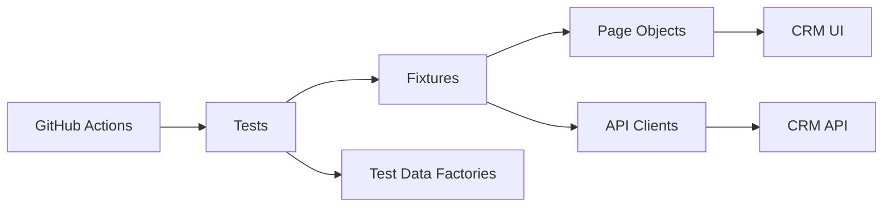

# Enterprise CRM Automation Framework

A production-style CRM quality engineering portfolio project built with **Playwright + TypeScript**.

This repository demonstrates reusable UI automation, API validation, synthetic test-data generation, accessibility checks, CI/CD execution, reporting, and maintainable test architecture.

## Why this project exists

Most commercial CRM systems and automation frameworks are proprietary. This project was independently created using public demo applications and synthetic data to demonstrate enterprise automation skills without exposing any confidential employer or client information.

## Business areas covered

- Authentication
- Contacts
- Companies
- Opportunities
- Sales pipeline
- Search and filters
- Role/permission-oriented scenarios
- API validation
- Accessibility checks
- CI/CD execution

## Tech stack

- Playwright
- TypeScript
- Node.js
- Faker
- axe-core
- GitHub Actions
- ESLint
- Prettier

## Architecture



## Project structure

```text
enterprise-crm-automation-framework/
├── .github/workflows/
├── api/
├── config/
├── data/
├── docs/
├── fixtures/
├── pages/
├── tests/
│   ├── ui/
│   ├── api/
│   └── accessibility/
├── .env.example
├── playwright.config.ts
├── package.json
└── README.md
```

## Setup

```bash
npm install
npx playwright install
cp .env.example .env
```

## Run tests

```bash
npm test
npm run test:smoke
npm run test:api
npm run test:a11y
```

## Example business workflow

```text
Login
→ Search customer
→ Add product to customer journey
→ Validate UI state
→ Validate supporting API resource
→ Clean test state
```

## Portfolio and confidentiality notice

This project is an independent portfolio implementation. It does not contain employer source code, internal test cases, screenshots, production credentials, customer records, proprietary APIs, business rules, or confidential documentation.

All test scenarios, framework code and documentation were created specifically for public portfolio demonstration.

## Interview talking points

- Why page objects are used
- Why test setup should prefer APIs where possible
- Why tests should be isolated and parallel-safe
- Why test data must be synthetic
- How smoke and regression suites differ
- How traces/screenshots help CI debugging
- Why accessibility checks belong in the automation pipeline
